# Avaliação — Engenharia de Software
**Sistema Integrado de Gestão de Farmácia — MVP Definido pelo Estudante**

Aluno: Lucas Paulino Gomes
RA: 24000580
Data: 26/03/2026

---

# 1. Definição do MVP

O MVP consiste em três partes principais para o funcionamento básico do software:
- Compras e vendas, incluindo o processo do início até o registro/checkout
- Gestão de estoque, intimamente ligado às vendas para controlar a quantidade de cada produto
- Financeiro, para registrar tanto as contas a pagar quanto a receber, à vista e a prazo

Haverá tratamento de erros básico no sistema. Todo o resto estará fora, pois não é estritamente
necessário para o funcionamento.

---

# 2. Regras de Negócio (mínimo: 5)
Liste e descreva **cada RN** de forma clara.

**RN01 — Limite pela quantidade em estoque**
Cada venda só poderá ser realizada se houver quantidade suficiente do produto
requisitado em estoque

**RN02 — Cadastro de produto**
Um novo produto só deve ser cadastrado se tiver todas as informações requisitadas

**RN03 — Produto esgotado**
Produtos fora do estoque não podem ser vendidos

**RN04 — Histórico do cliente**
Devoluções deverão ser registradas no histórico do cliente

**RN05 — Cancelamento de venda**
Uma venda só poderá ser cancelada se
1. o produto não tiver sido utilizado, e
2. a devolução for realizada dentro de 15 dias

---

# 3. Requisitos Funcionais (mínimo: 8)

**RF01 — Registrar venda**
Registro de venda realizadas no balcão ou por telefone, podendo ser
à vista (pagamento imediato) ou a prazo (pagamento parcelado ou postergado)

**RF02 — Atualizar estoque**
Atualização automática das quantidades em estoque após qualquer uma dessas
operações:
- venda
- devolução
- perda
- transferência
- reposição após compra

**RF03 — Cadastrar produto**
Cadastro de novo produto com descrição, preço de venda, unidade de medida e fabricante

**RF04 — Registrar cliente**
Registro de cliente no banco de dados da farmácia com nome e CPF/CNPJ

**RF05 — Vincular produto ao cliente**
Cada nova venda pode ser vinculada a um cliente caso ele esteja registrado no sistema

**RF06 — Notificar vencimento de conta**
O sistema deve enviar uma notificação ao gerente quando uma conta (a pagar ou a receber)
estiver a 1 semana de vencer, e outra quando estiver vencida

**RF07 — Atualizar conta a pagar/receber**
Quando uma conta vencer ou for paga, o sistema deve ajustar o status para o valor correspondente

**RF08 — Cancelar venda**
Numa devolução, a venda pode ser cancelada

**RF09 — Emitir comprovante**
O sistema deve emitir um comprovante a cada venda realizada

---

# 🛡 4. Requisitos Não Funcionais (mínimo: 4)
Liste os RNFs do sistema conforme seu MVP.

**RNF01 — (Eficiência de Desempenho) Tempo de resposta**
O sistema dever responder a solicitações simples em menos de 30ms

**RNF02 — (Segurança) Operações financeiras**
Todas as operações financeiras devem ser autenticadas com tokens e registradas para auditoria

**RNF03 — (Interoperabilidade) Padrão de comunicação**
O sistema deve utilizar padrões REST para comunicação em rede, a fim de facilitar
a integração entre diferentes unidades da empresa

**RNF04 — (Manutenibilidade) Estrutura do código**
A aplicação deve ser modular e apresentar baixo acoplamento entre módulos e classes

---

# 5. Casos de Uso (mínimo: 10)

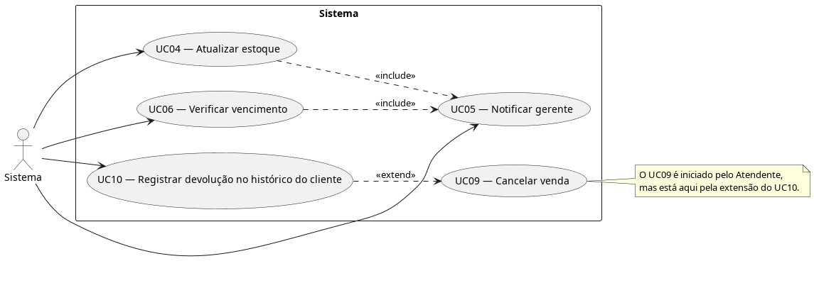
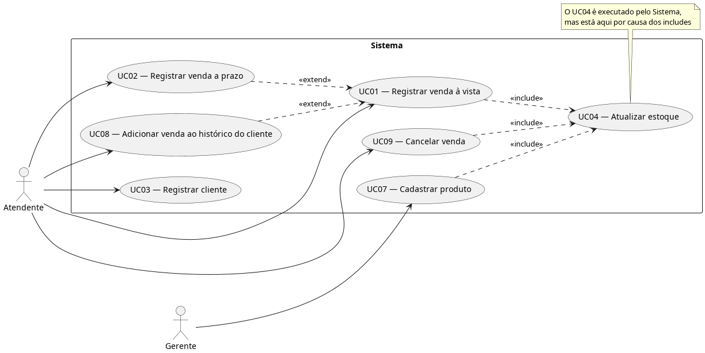

---

# 6. Documentação dos Casos de Uso

## **UC01 — Registrar venda à vista**
**Ator(es):** Atendente
**Descrição:** Registra a venda de um medicamento
**Pré-condições:** Nenhuma
**Pós-condições:** Venda registrada e estoque atualizado

### Fluxo Principal
1. Atendente pesquisa um produto no sistema
2. Sistema procura e retorna os resultados correspondentes
3. Atendente seleciona o produto desejado
4. Atendente insere a quantidade
5. Sistema valida a quantidade e atualiza o estoque
6. Atendente marca a venda como à vista
7. Sistema registra a venda no banco e retorna sucesso
8. Sistema emite comprovante

### Fluxos Alternativos / Exceções
- FA01 — Produto não encontrado
1. Sistema retorna mensagem de "não encontrado"
- FA02 — Estoque insuficiente
Ver UC04
- FA03 — Registro de venda a prazo
Ver UC02

### Relacionamentos
- **Include:** UC04

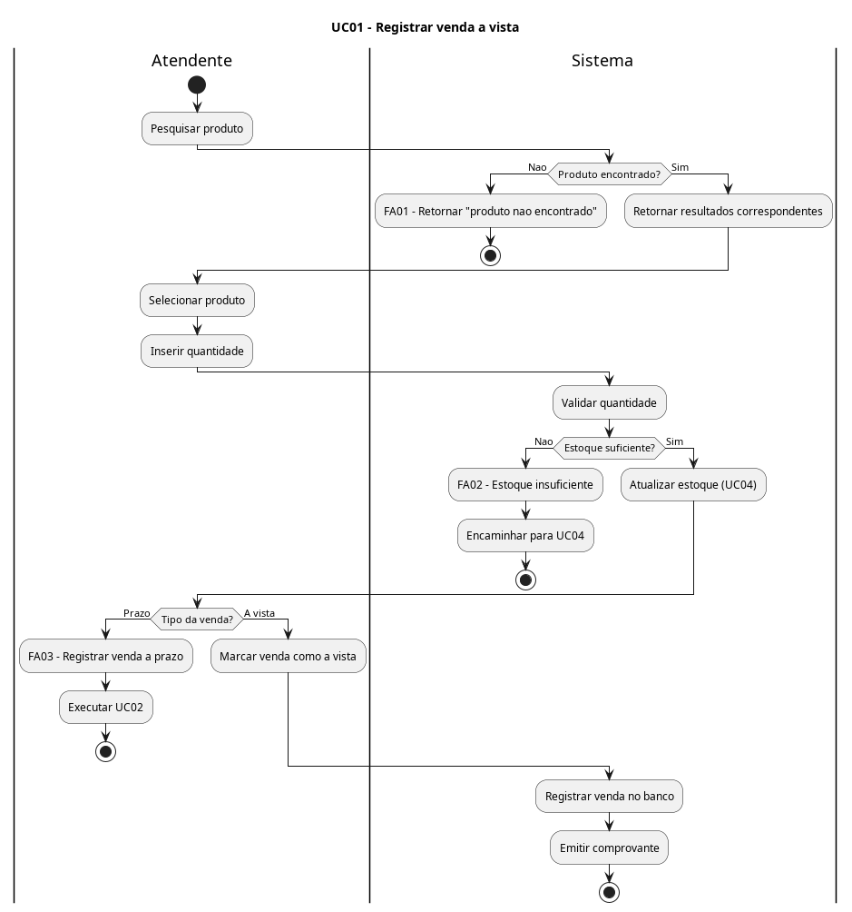

---

## **UC02 — Registrar venda a prazo**
**Ator(es):** Atendente
**Descrição:** Registrar vendas de medicamentos a prazo
**Pré-condições:** Nenhuma
**Pós-condições:** Venda a prazo adicionada às contas a receber

### Fluxo Principal
1. Atendente inicia o registro da venda
2. Atendente marca a venda como a prazo
3. Sistema adiciona a venda às contas a receber
4. Sistema retorna mensagem de sucesso
5. Sistema emite comprovante

### Fluxos Alternatiivos / Exceções
Nenhum aparente

### Relacionamentos 
- **Extend:** UC01

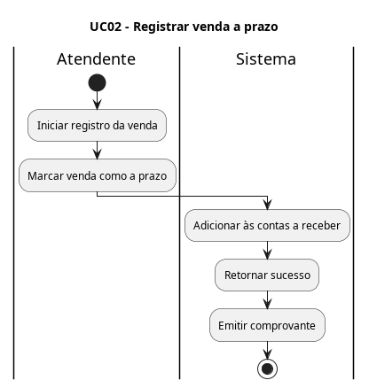

---

## **UC03 — Registrar cliente**
**Ator(es): Atendente**
**Descrição: Registro de cliente para acompanhamento do histórico de compra**
**Pré-condições: Nenhuma**
**Pós-condições: Cliente registrado no banco de dados da empresa**

### Fluxo Principal
1. Atendente abre a página de registro de cliente
2. Atendente insere as informações do cliente
3. Sistema verifica a existência do cliente no banco
4. Sistema cadastra o cliente no banco
5. Sistema retorna mensagem de sucesso

### Fluxos Alternativos / Exceções
- FA01 — Dados insuficientes
1. O atendente tenta cadastrar sem algum dos dados necessários
2. Sistema identifica o erro e retorna um aviso
- FA02 — Cliente existente
1. Sistema encontra um cliente com os mesmos dados no banco
2. Sistema retorna um aviso e os dados

### Relacionamentos
Nenhum

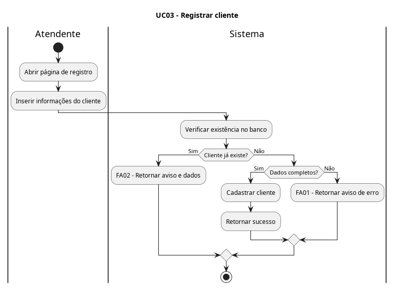

---

## **UC04 — Atualizar estoque**
**Ator(es): Sistema**
**Descrição: Atualizar as quantidades de estoque aplicando as regras de negócio**
**Pré-condições: Produto(s) cadastrado(s) no estoque, uma das operações descritas em RF02 realizada**
**Pós-condições: Quantidade do(s) produto(s) atualizada no estoque**

### Fluxo Principal
1. Uma operação (venda, devolução, perda, transferência, reposição) é realizada
2. O sistema recebe os produtos afetados com suas respectivas quantidades
3. O sistema compara as quantidades requisitadas com as em estoque
4. O sistema atualiza as quantidades em estoque e retorna sucesso

### Fluxos Alternativos / Exceções
- FA01 — Estoque insuficiente
1. O sistema identifica que a quantidade requisitada excede a em estoque
2. O sistema retorna mensagem de erro
- FA02 — Notificar gerente do esgotamento do estoque
1. Sistema identifica que a quantidade atualizada está abaixo de um nível mínimo
2. Sistema envia notificação ao gerente conforme UC05

### Relacionamentos
- **Include:** UC05

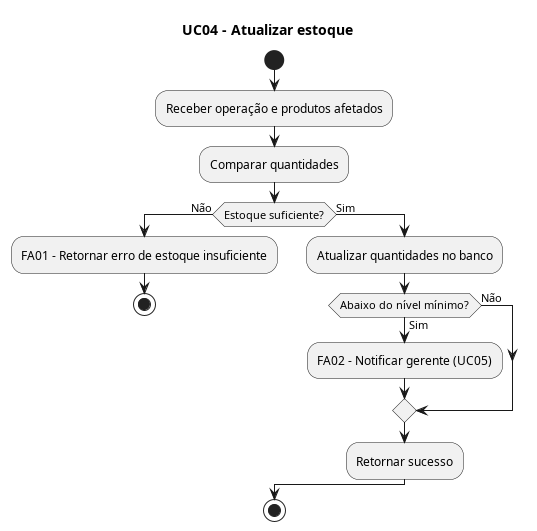

---

## **UC05 — Notificar gerente**
**Ator(es):** Sistema
**Descrição:** Enviar notificação ao gerente sobre assuntos que precisam da sua atenção
**Pré-condições:** Nenhuma
**Pós-condições:** Notificação enviada e registrada

### Fluxo Principal
1. O sistema recebe uma solicitação de envio de notificação de outra parte do sistema
2. O sistema constrói uma mensagem correspondente ao tópico recebido (vencimento de contas, estoque esgotando)
3. O sistema envia um email e um SMS para o gerente
4. O sistema registra a notificação e retorna sucesso

### Fluxos Alternativos / Exceções
- FA01 — Serviços indisponíveis
1. O sistema reconhece que um ou ambos os serviços encontram-se indisponíveis
2. O sistema espera alguns minutos e tenta reenviar a mensagem, repetindo o processo 3 vezes
3. O sistema registra o erro e reagenda o envio para algumas horas mais tarde
4. O sistema retorna uma notifição interna acerca da indisponibilidade dos serviços

### Relacionamentos
Nenhum

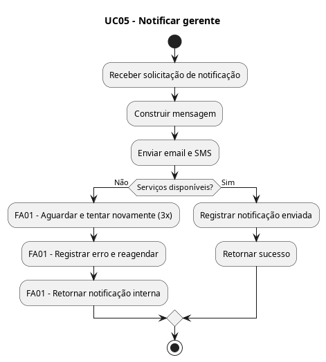

---

## **UC06 — Verificar vencimento**
**Ator(es):** Sistema
**Descrição:** Verificar o vencimento de contas
**Pré-condições:** Conta a pagar/receber registrada
**Pós-condições:** Status da conta mantido ou atualizado

### Fluxo Principal
1. O sistema aciona um serviço automático diário de verificação
2. O sistema compara as datas de cada conta a pagar e a receber com a data atual
3. O sistema mantém o status da conta se ela estiver dentro do prazo
4. O sistema encerra a verificação

### Fluxos Alternativos / Exceções
- FA01 — Conta próxima do vencimento
1. A data da conta está a 1 semana ou menos do vencimento
2. O sistema notifica o gerente do vencimento próximo
- FA02 — Conta vencida
1. A data da conta é anterior à data atual
2. O sistema altera o status da conta para "atrasada"
3. O sistema notifica o gerente do vencimento

### Relacionamentos
- **Include:** UC05

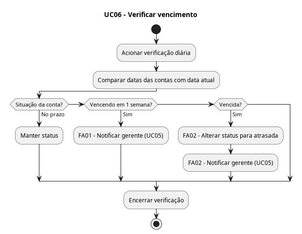

---

## **UC07 — Cadastrar produto**
**Ator(es):** Gerente
**Descrição:** Adicionar novo produto ao estoque
**Pré-condições:** Nenhuma
**Pós-condições:** Novo produto cadastrado no estoque

### Fluxo Principal
1. Gerente acessa aba de cadastro de produto
2. Gerente insere informações do novo produto
3. Gerente confirma criação
4. Sistema valida informações do produto
5. Sistema registra produto no banco e retorna sucesso
6. Gerente insere a quantidade do produto
7. O sistema atualiza o estoque como reposição

### Fluxos Alternativos / Exceções
- FA01 — Informações insuficientes
1. O gerente confirma a criação sem inserir todas as informações
2. O sistema retorna mensagem de erro e cancela a criação

### Relacionamentos
- **Include:** UC04

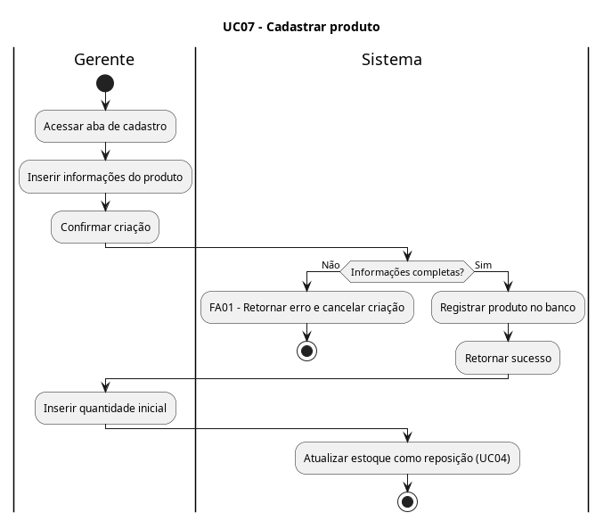

---

## **UC08 — Adicionar venda ao histórico do cliente**
**Ator(es):** Atendente
**Descrição:** Vincula uma venda a um cliente cadastrado
**Pré-condições:** Cliente cadastrado
**Pós-condições:** Venda registrada no histórico do cliente

### Fluxo Principal
1. Atendente inicia um registro de venda
2. Atendente insere dados do cliente no registro de venda
3. Sistema verifica cadastro do cliente
4. Sistema insere registro da venda no histórico do cliente
5. Sistema retorna mensagem de sucesso

### Fluxos Alternativos / Exceções
- FA01 — Cliente não cadastrado
1. Sistema não encontra cadastro
2. Sistema retorna aviso

### Relacionamentos
- **Extend:** UC01

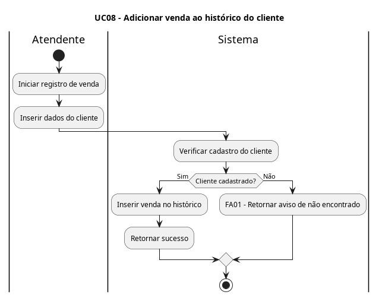

---

## **UC09 — Cancelar venda**
**Ator(es):** Atendente
**Descrição:** Cancela uma venda previamente realizada, processando a devolução do produto
**Pré-condições:** Venda registrada no sistema
**Pós-condições:** Status da venda alterado para cancelado e estoque atualizado

### Fluxo Principal
1. Atendente localiza a venda correspondente no sistema
2. Atendente solicita o cancelamento e a devolução do item
3. Sistema verifica se a venda ocorreu há no máximo 15 dias (RN05)
4. Sistema altera o status da venda para "cancelada"
5. Sistema envia os dados do produto devolvido para atualização do estoque
6. Sistema retorna mensagem de sucesso e emite comprovante de cancelamento

### Fluxos Alternativos / Exceções
- FA01 — Condições de devolução não atendidas
1. Sistema identifica que o prazo de 15 dias expirou ou o atendente marca que o produto foi utilizado
2. Sistema bloqueia a operação
3. Sistema retorna mensagem de erro

### Relacionamentos
- **Include:** UC04

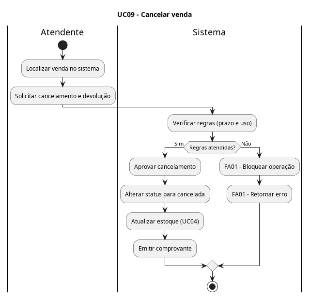

---

## **UC10 — Registrar devolução no histórico do cliente**
**Ator(es):** Sistema
**Descrição:** Registra o evento de devolução e cancelamento no histórico do cliente correspondente
**Pré-condições:** Cancelamento de venda registrado
**Pós-condições:** Histórico do cliente atualizado com o registro da devolução

### Fluxo Principal
1. Sistema identifica que a venda recém-cancelada possuía vínculo com um cliente cadastrado
2. Sistema acessa o banco de dados e localiza o cadastro do cliente
3. Sistema insere os detalhes da devolução (data, produto e motivo) no histórico do cliente (RN04)
4. Sistema conclui a operação em segundo plano

### Fluxos Alternativos / Exceções
- FA01 — Venda sem cliente vinculado
1. Sistema identifica que a venda cancelada não possuía um cliente associado
2. O fluxo é encerrado sem realizar alterações em banco de dados

### Relacionamentos
- **Extend:** UC09

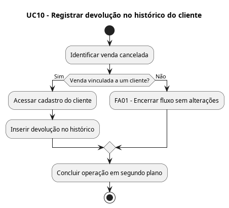
